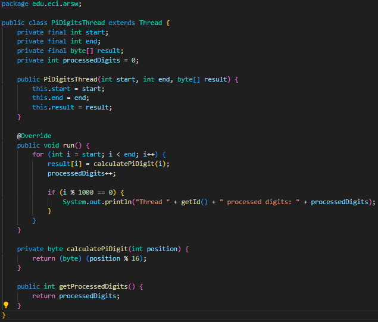

### Escuela Colombiana de Ingeniería
### Arquitecturas de Software - ARSW
## Ejercicio Fórmula BBP - Parcial Practico

**Ejercicio Fórmula BBP**

La fórmula [BBP](https://en.wikipedia.org/wiki/Bailey%E2%80%93Borwein%E2%80%93Plouffe_formula) (Bailey–Borwein–Plouffe formula) es un algoritmo que permite calcular el enésimo dígito de PI en base 16, con la particularidad de no necesitar calcular nos n-1 dígitos anteriores. Esta característica permite convertir el problema de calcular un número masivo de dígitos de PI (en base 16) a uno [vergonzosamente paralelo](https://en.wikipedia.org/wiki/Embarrassingly_parallel). En este repositorio encontrará la implementación, junto con un conjunto de pruebas. 

Para este ejercicio se quiere calcular, en el menor tiempo posible, y en una sola máquina (aprovechando las características multi-core de la mismas) al menos el primer millón de dígitos de PI (en base 16). Para esto

1. Cree una clase de tipo Thread que represente el ciclo de vida de un hilo que calcule una parte de los dígitos requeridos.

2. Haga que la función PiDigits.getDigits() reciba como parámetro adicional un valor N, correspondiente al número de hilos entre los que se va a paralelizar la solución. Haga que dicha función espere hasta que los N hilos terminen de resolver el problema para combinar las respuestas y entonces retornar el resultado. Para esto, puede utilizar el método Join() del API de concurrencia de Java.

3. Ajuste la implementación para que cada 5 segundos los hilos se detengan e impriman el número de digitos que han procesado y una vez se presione la tecla enter que los hilos continúen su proceso.